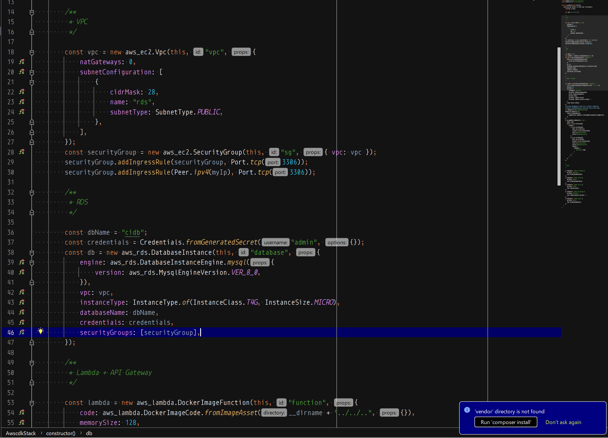
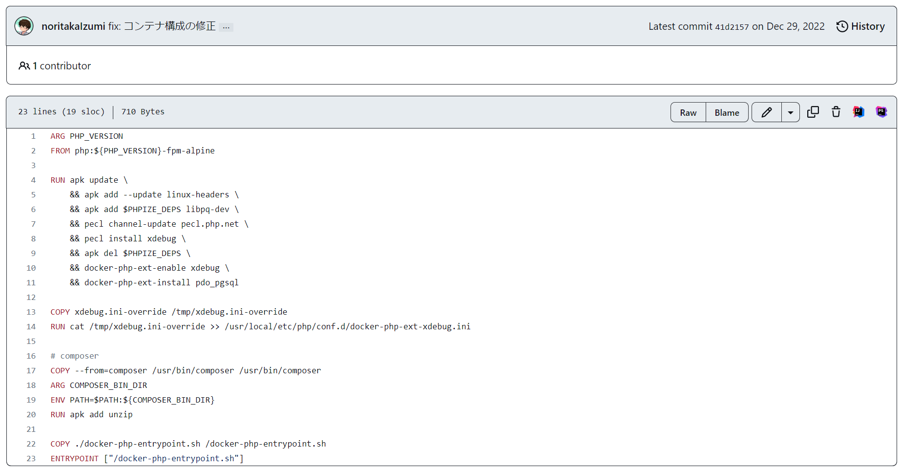

みなさんは自分の書いたコード、どうやって見直してますか？ :pencil2:

自分で書いたコードの間違いや改善点を見つけ出すのは難しいものです :thinking:
社内にレビュアーがいればいいですが、いない場合や、個人開発している場合などはなかなか時間が割けないことも・・・
自分自身の知見には限りがありますし、固定観念などが入ってしまうこともあります :cry:

でも、他人の書いたコードの改善点は意外と見つけやすかったりしないでしょうか？
私のつたない経験上ですが、自分のコードよりも明らかに数がたくさん見つかる気がするのです。

ならば **自分の書いたコードが他人の書いたコードに見えればいいんじゃないでしょうか？**
ということで、この記事では自分の書いたコードが他人の書いたコードに見えるために私が実践していることをご紹介します。


個人開発などでは、個人の書いたコードをレビューするような C to C のサービスも選択肢に入ってきます。そちらも合わせてご検討ください。


## 1. コードを書いた後、数日空けてからもう一度見る

時間と記憶に対する有名な研究で、「エビングハウスの忘却曲線」というものがあります。
それによれば、人間は学習したときから 1 週間経過すると、約 77 % 忘れてしまうとのこと。

https://keiei-shinri.or.jp/word/%E3%82%A8%E3%83%93%E3%83%B3%E3%82%B0%E3%83%8F%E3%82%A6%E3%82%B9%E3%81%AE%E5%BF%98%E5%8D%B4%E6%9B%B2%E7%B7%9A/

自分でコードを書いてから数日空けると、何を書いたか忘れていることが多いので、ある意味他人です。
他人の視点、新たな視点を持ってコードを見直すことができるかもしれません。

私はこれを **冷凍保存** と呼んでいます :snowflake:
冷凍した物を忘れても、冷凍したことくらいは覚えておきましょう :fried_shrimp:

## 2. 寝て起きてからもう一度見る

コードを書いたら、個人開発だからと言って直ぐにリリースしたりせず、一旦寝ます。
行き詰ったところで切り上げて寝ます。
で、翌朝起きたらもう一度コードを見ます。

寝ている間に記憶が定着・整理され、翌朝には脳の領域に余裕がある状態でコードを見ることができます！
前の日いくら考えてもわからなかったことが一瞬で解決することもあります！ :star2:

私はこれを **熟成** と呼んでいます :meat_on_bone:
案件をこなす上でこの方法には幾度となく助けられてきました。

ベテランエンジニアの方の中には、仕事中に寝てこの効果を享受している人もいるんだとか・・・
（ただし、これをマネージャー層に理解してもらうのは非常に難しいので、自己責任でお願いします）

## 3. 別の UI 上で自分の書いたコードを見る

例えば、

いつも使い慣れているエディタではこんな感じの見た目で・・・

GitHub 上ではこんな感じの見た目で・・・

背景色や画面の配置、フォントなどが違うと、印象も異なります。
それによって目線の誘導のされ方が変わるかもしれません。

自分でイシューを作成し、プルリクエストを作成し、見てみるのもおすすめです。

私はこれを **イメチェン** と呼んでいます :girl:
知り合いの女の子がイメチェンしてきたら、今まで気づかなかった良さに気づくこともありますよね！ :laughing:
そういうことです。


スクリーンショット中のコードは良くないコードです！
あまりジロジロ見ないでください！ :cop: :police_car:


---

よろしければ参考にしてみてください。
みなさんのコーディングライフに幸多からんことを :pray:
