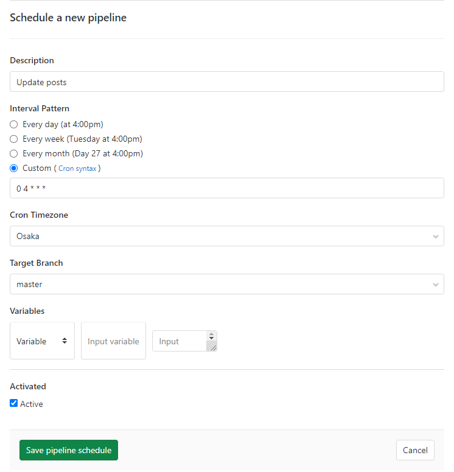

## :bulb: まとめ


Hugo でブログを立ち上げたとき、ブログの記事は別リポジトリで管理するとコミットログが汚くならない


CI/CD を使ってブログ記事のリポジトリをクローン・ビルドするパイプラインを組んでおけば、ブログ本体のソースを触る必要がなくなる


---

## :seedling: 背景

初投稿でした話ですが、このサイトの立ち上げには [`Hugo`](https://gohugo.io/) を使用しています。

ソースコードを管理する際に Git (当サイトは GitLab) を使用するわけですが、そうすると、ブログ記事を追加するためだけにコミットログを積まなければならなく、コミットログが非常に汚くなってしまいます。


記事を 3 回加筆修正しただけでこんなにコミットログが積まれます:cry:


<!-- @IGNORE PREVIOUS: link -->

そこで考えたのが...

> ブログ記事だけ別リポジトリにすればいいんじゃね？

です。

## :thinking_face: 考えた方法

「ブログ記事だけ別リポジトリに」した後を考えます。

#### サブモジュール化する

Git にはサブモジュールという便利な機能があって、これを使うと少なくともブログ記事のコミットログは別で管理できます。

ところが、サブモジュールに関する [ある記事](https://qiita.com/sotarok/items/0d525e568a6088f6f6bb) を読んだところ、サブモジュールの更新があった場合に自分で更新を読み込まなければいけないようです。

結局は `Update submodule: posts` のようなコミットログを積まないといけないことになるので、面倒というよりはブログ記事のように<mark>更新頻度の高いコンテンツをサブモジュール化するのはあまり向いていない</mark>と感じました。

そんなこんなで採用したのが次の方法です。

#### ブログ記事をクローン・ビルドするパイプラインを組む

`.gitlab-ci.yml` を以下のように書いて CI/CD を設定しました。（実際はもっといろんな処理を書いていますが、概略はこんな感じです）

```yaml
image: registry.gitlab.com/pages/hugo:latest

variables:
  GIT_SUBMODULE_STRATEGY: recursive

pages:
  script:
    - apk update && apk --no-cache add git
    - git clone ${ブログ記事の URL}
    - git clone ${ブログ記事画像の URL}
    - hugo
  artifacts:
    paths:
      - public
  only:
    - master
```

これで、 `master` ブランチに何かをプッシュするだけでパイプラインが実行され、記事の更新が可能となります！:smile:


パイプライン上で `git clone` しますので、ビルド成果物に `.git` が含まれないように注意しましょう。



GitLab においてプライベートリポジトリを HTTPS 経由でクローンする場合は、ユーザー名・パスワードの記載が必要です。二段階認証を利用している場合は、アクセストークンが必要です。これらは GitLab 上の環境変数に設定して参照するようにし、スクリプトに直接書かないようにしましょう。


GitLab における環境変数は、リポジトリのページから 「Settings → CI / CD → Variables」 と進むと設定できます。

詳しくは [こちら](https://docs.gitlab.com/ee/ci/variables/README.html#custom-environment-variables)

<!-- @IGNORE PREVIOUS: link -->

## :clock4: 定期実行も設定する

GitLab にはパイプラインを定期実行してくれる便利な機能があります。

せっかくなので設定してみようと思います。

リポジトリのページから 「CI / CD → Schedules → New schedule」と進み、日本時間毎朝 4 時にパイプラインを実行するように設定してみます。

<!-- @IGNORE PREVIOUS: link -->

これで定期実行も完成です。

ちゃんと実行できるかどうか心配な場合は一覧画面から手動実行することもできます。

---

最後まで読んでいただきありがとうございました！:wink:
