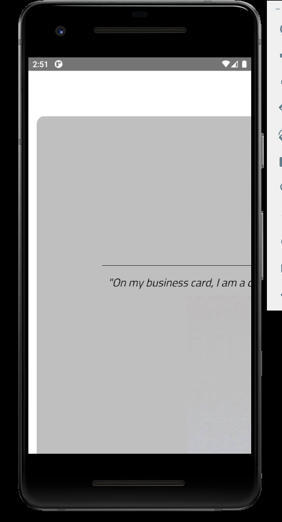

こちらの記事は [トラストバンク Advent Calendar 2023](https://qiita.com/advent-calendar/2023/trustbank)
の 11 日目の記事です。

---

普段は Web エンジニアとして開発をしている私ですが、いつかモバイルアプリを作ってみたいと思っていました。  
しかし、必要なソフトをインストール・設定したり、新たな言語を学習したり、アプリストアの審査を通したりと、複雑な工程がたくさんあり、
なかなかやる気が起きずにいました。  
そんな中、Capacitor というツールが Web アプリケーションを簡単にモバイルアプリを作れると知り試してみたところ、
確かに簡単だと感じたので、紹介させていただきます。

[Capacitor - by Ionic: Webアプリをクロスプラットフォームに展開](https://capacitorjs.jp/)

## 書くこと・書かないこと

書くこと

- Capacitor の概要
- 既存の Web アプリに Capacitor を追加して動作確認する方法

書かないこと

- Android Studio の使い方
- アプリへの署名方法・アプリストアへの登録方法

## Capacitor とは

Web アプリから Android/iOS や PWA で動作するアプリを作れるライブラリです。  
Ionic 社によって開発されており、Android/iOS で必要になるカメラや位置情報、通知などへアクセスできる機能も提供されています。

## 環境

今回は Android アプリを作成します。

- 使用マシン：Windows
- インストール済みのアプリ
  - Git
  - Android Studio
  - Node.js バージョン 16 以上

## 手順

### Android Studio の中で Android SDK をインストールする

Android Studio を起動し、トップ画面が表示されたら、**Customize -> All settings...** と進んで設定画面を開き、
**Languages & Frameworks -> Android SDK** と進みます。


**SDK Platforms** タブから API Level 22 以上の Android SDK Platform をインストールします。
ここでは Android 11.0 ("R") をインストールしています。

### 既存の Web アプリに Capacitor をインストール・設定する

既存の Web アプリとして、今回は他の方のリポジトリを拝借させていただきます :bowing_man:

https://github.com/seanmiles/example-webpage

```bash
git clone https://github.com/seanmiles/example-webpage.git
cd example-webpage
```


Android アプリを開発しますので、ソースコードは WSL 上ではなく Windows のファイルシステム上にクローンします。


アプリのルートに Capacitor をインストールします。

```bash
npm i @capacitor/core
npm i -D @capacitor/cli
```

Capacitor の設定を初期化します。
アプリ名やディレクトリなどの質問事項に答えていきますが、ここでは何もせずにエンターで進んでいます。

```bash
npx cap init
```

```text
$ npx cap init
[?] What is the name of your app?
    This should be a human-friendly app name, like what you'd see in the App Store.
√ Name ... App
[?] What should be the Package ID for your app?
    Package IDs (aka Bundle ID in iOS and Application ID in Android) are unique identifiers for apps. They must be in
    reverse domain name notation, generally representing a domain name that you or your company owns.
√ Package ID ... com.example.app
[?] What is the web asset directory for your app?
    This directory should contain the final index.html of your app.
√ Web asset directory ... www
√ Creating capacitor.config.json in C:\Users\norit\sources\example-webpage in 4.99ms
[success] capacitor.config.json created!

Next steps:
https://capacitorjs.com/docs/getting-started#where-to-go-next
```

ここで、既存のアプリのディレクトリ設定を合わせます。

```bash
mkdir -p www
mv css www
mv js www
mv assets www
mv index.html www
```


Web asset directory がルートディレクトリ `.` でも行けるのかやってみたのですが、後のプロジェクト作成でエラーとなってしまうため、
ここではディレクトリを作成して既存のソースを移動しています。  
（Android/iOS アプリの外側だけを作るリポジトリを用意して、その中に Web のリポジトリを導入する方法でも良いかと思います。）


### Android プロジェクトを作成する

まず Android プラットフォームをインストールします。

```bash
npm i @capacitor/android
```

次に、以下のコマンドでネイティブアプリケーション用の Android プロジェクトを作成します。

```bash
npx cap add android
```

```text
$ npx cap add android
√ Adding native android project in android in 125.91ms
√ add in 127.25ms
√ Copying web assets from www to android\app\src\main\assets\public in 18.67ms
√ Creating capacitor.config.json in android\app\src\main\assets in 1.93ms
√ copy android in 37.21ms
√ Updating Android plugins in 1.95ms
√ update android in 371.32ms
√ Syncing Gradle in 685.70μs
[success] android platform added!
Follow the Developer Workflow guide to get building:
https://capacitorjs.com/docs/basics/workflow
```

### Web のソースコードを Android プロジェクトに同期させる

以下のコマンドで Android プロジェクトのコードを更新します。

```bash
npx cap sync
```

```text
$ npx cap sync
√ Copying web assets from www to android\app\src\main\assets\public in 23.29ms
√ Creating capacitor.config.json in android\app\src\main\assets in 1.71ms
√ copy android in 39.96ms
√ Updating Android plugins in 1.42ms
√ update android in 68.47ms
√ copy web in 1.84ms
√ update web in 993.20μs
[info] Sync finished in 0.124s
```


Web のコードを変更した際は毎回この `npx cap sync` を実行します。


### 動作確認する

以下のコマンドでエミュレータを起動し、動作確認します。

```bash
npx cap run android
```

ビルド中を示す出力の後、エミュレータが立ち上がります。

```text
$ npx cap run android
√ Copying web assets from www to android\app\src\main\assets\public in 25.85ms
√ Creating capacitor.config.json in android\app\src\main\assets in 2.61ms
[info] Inlining sourcemaps
√ copy android in 69.40ms
√ Updating Android plugins in 1.88ms
√ update android in 350.20ms
√ Please choose a target device: » Pixel 3 API 30 (emulator) (Pixel_3_API_30)
√ Running Gradle build in 71.63s
√ Deploying app-debug.apk to Pixel_3_API_30 in 65.87s
```

Web で表示されていたものが画面にちゃんと表示されました :tada:



## Capacitor は Android のソースを Git 管理下に置く

また、既存の Web アプリを変換するだけなら Android アプリのソースコードは Git 管理下に置く必要がないはずなのですが、
Capacitor では Git 管理下となっています。  
これにより、Capacitor でアプリを変換した後に細かな調整をする・Capacitor でできないことをコードの直接編集で実現したいときに、
その変更を Git に反映することが可能となります。

## まとめ

いかがでしたでしょうか？ Capacitor は Web エンジニアにとって非常に扱いやすいツールです。  
今回この記事を書くにあたって、本来 Android アプリに必要な Java, Kotlin, Dart などの言語は習得していません。
基本的に今あなたがお持ちの知識だけでアプリが作れます。

みなさんもぜひ Capacitor で Android アプリエンジニアデビューへの道を歩みましょう :smiling_face_with_three_hearts:
