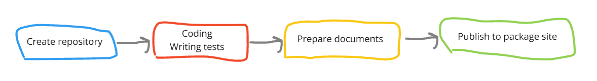

みなさんはオープンソースの開発に参加したことはありますか？

GitHub でならリポジトリへ Pull Request を送ってマージしてもらったり、
リポジトリの Issue や Pull Request にコメントやレビューを書いたりなど、様々な方法で参加することができます。

では、みなさんはオープンソースを 1 から作成して、以下のようなパッケージサイトにアップしたことがありますか？

- [PyPI](https://pypi.org/) (Python)
- [npm](https://www.npmjs.com/) (Node.js)
- [Packagist](https://packagist.org/) (PHP)

私は今までやったことがありませんでした。

今回、とあるきっかけがあって Python 製のオープンソースを作成し、PyPI にアップするところまでをやってみましたので、
一連の流れを紹介しようと思います。

## 今回作ったもの

社内で使っている某データベースマイグレーションツールが使いにくいと感じており、
より使いやすいツールが欲しかったため、今回作成しています。

[chronovoyage - PyPI](https://pypi.org/project/chronovoyage/)


マイグレーションで適用するクエリを Raw SQL で記述し、接続先を指定してワンコマンドでマイグレートできます。

```shell
chronovoyage migrate
```

詳しくは [Chronovoyage Documentation](https://chronovoyagemigration.net/) をご覧ください。

---

## 全体的な流れ

おおざっぱには以下のような流れで作成していきます。



- リポジトリの作成
- コーディング・テスト
- ドキュメント類の整備
- パッケージのビルド・デプロイ

TODO
