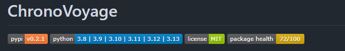

こちらの記事は [トラストバンク Advent Calendar 2024](https://qiita.com/advent-calendar/2024/trustbank)
の 20 日目の記事です。


みなさんはオープンソースの開発に参加したことはありますか？

GitHub でならリポジトリへ Pull Request を送ってマージしてもらったり、
リポジトリの Issue や Pull Request にコメントやレビューを書いたりなど、様々な方法で参加することができます。

では、みなさんはオープンソースを 1 から作成して、以下のようなパッケージサイトにアップしたことがありますか？

- [PyPI](https://pypi.org/) (Python)
- [npm](https://www.npmjs.com/) (Node.js)
- [Packagist](https://packagist.org/) (PHP)

私は今までやったことがありませんでした。

今回、とあるきっかけがあって Python 製のオープンソースを作成し、パッケージサイトにアップするところまでをやってみましたので、
一連の流れを紹介しようと思います。

## 今回作ったもの

社内で使っている某データベースマイグレーションツールが使いにくいと感じており、
より使いやすいツールが欲しかったため、今回作成しました。

[chronovoyage - PyPI](https://pypi.org/project/chronovoyage/)


マイグレーションで適用するクエリを Raw SQL で記述し、接続先を指定してワンコマンドでマイグレートできます。

```shell
chronovoyage migrate
```

詳しくは [Chronovoyage Documentation](https://chronovoyagemigration.net/) をご覧ください。

---

## 全体的な流れ

おおざっぱには以下のような流れで作成していきます。


普段の開発と何ら変わりありませんが、オープンソースにおいて意識しなければならない点もありますので、順に説明していきます。

- リポジトリの作成
- コーディング・テスト
- ドキュメント類の整備
- パッケージのビルド・デプロイ


以下の記事では、オープンソースの開発に対して会社での開発を「プロダクト開発」と表現しています。


## リポジトリの作成

#### GitHub にリポジトリを作成する

私自身、普段は GitLab でリポジトリを作成しますが、今回は GitHub で作成しました。  
GitHub で作成した理由は以下の通りです。

- オープンソースの多くが GitHub で管理されており、オープンソースを作成する際に参考にしやすい
- GitHub Codespaces を使えばクラウド環境を簡単に構築でき、他の人が開発に参加するハードルを下げられる
- これから使う各種ツール類において、GitHub Actions での CI/CD 構築手順が充実している

#### Hatch を使ってプロジェクトを作成する

今回は Python パッケージに必要な環境管理・テスト・静的解析・パッケージビルドなどのコマンドが一つにまとまった
[Hatch](https://hatch.pypa.io/latest/) を使用しました。


従来は Python の複数環境切り替えのために pyenv を入れ、テストのために pytest を入れ、複数バージョンテストのために tox を入れ、
静的解析のために isort/black/flake8/mypy/ruff 等を入れ、パッケージ作成・ビルドのために build を入れ・・・
とツール類をいろんなところから探してこなければなりませんでした。  
[Hatch](https://hatch.pypa.io/latest/) ではこれらのツールが内包されており、すべては
`hatch` コマンドで実行できるので非常に簡単です。


例えば、プロジェクトは以下のコマンドで簡単に作成できます。

```shell
hatch new "My project"
```

テストは `hatch test`、静的解析はデフォルトでは `hatch run types:check` で簡単に実行できます。

## コーディング・テスト

#### 複数バージョンに対応する

オープンソースにおけるコーディングでもっとも重要なのが、「複数バージョンに対応すること」です。

オープンソースを使う人の環境は様々なので、多くの人が使えるようにするためにより互換性のあるコードを書く必要があります。
Python なら現在は Python 3.8 以降に対応した方がよく、普段の開発には Python 3.8 を使用します。  
「Python 3.8 以降に対応」をサービス品質として掲げるためには、複数バージョンでのテストを CI に組み込み、
適切なテストが常に実行されている必要があります。

プロダクト開発においては、セキュリティ品質上の理由から不定期でのバージョンアップが必要になります。  
複数バージョンで対応できるような体制を構築しておくと、いざバージョンアップをする際に工数が削減できるかもしれません。

#### 静的解析

一人で開発するならまだしも、オープンソースはこの先不特定多数のエンジニアが編集・利用するものですから、
静的解析を行うことで型のミスによるバグやレアケースでの不具合を未然に防いだ方が良いと考えます。  
開発環境は人によってまちまちであるため、特定のエディタでしか使えない特殊なツールではなく、
基本的にはコマンドラインで完結できるようなものを用意するのが望ましいです。


私の理想は、IntelliJ (JetBrains 社), VSCode, Vim, GitHub Codespaces のどれを使っても安全なコードが書けることです。


#### エラーハンドリング

Python のオープンソースを使う人すべてが Python の言語仕様に精通しているわけではありませんし、
オープンソースのコードそのものを理解しているわけでもありません。  
特に、今回私が作ったようなデータベースマイグレーションツールの場合、Python コード内で import して使うのではなく
Linux コマンドのように使うことが想定されています。

そのため、プログラム内部で起きうる例外を補足し、独自の例外クラスを投げ直したり・エラーログを出力することで
利用者にわかりやすくエラーを伝える必要があります。

```python
import os
from logging import getLogger

class FailedToMakeDirectoryError(Exception):
    def __init__(self, directory: str) -> None:
        super().__init__(f"failed to make directory \"{directory}\".")

logger = getLogger()
try:
    os.makedirs('sample')
except OSError:
    e = FailedToMakeDirectoryError('sample')
    logger.error(e.__str__())
```

#### コミットログ

コミットログも開発者すべてにとってわかりやすい形を採用した方が良いと思います。私が見やすいと思うものを 2 つ紹介します。

##### Conventional Commits

[Conventional Commits](https://www.conventionalcommits.org/en/v1.0.0/) は開発種別（機能開発・バグ修正・ビルド周りなど）と
開発スコープを明らかにする手法で、AngularJS などで用いられているフォーマットです。

```text
fix: unclear error message when file not found
```

```text
build(core): update version to 0.1.6
```

##### 絵文字を記載する

開発種別ごとに決まった絵文字を使うことで、開発内容が一目でわかるようにする手法です。

```text
🐛 verbose オプションで設定されるログレベルが間違っていたので修正
```

```text
🔨 バージョン番号の出力方法を変更
```

## ドキュメント類の整備

不特定多数の開発者・利用者を束ねるにはドキュメントが必要です。  
また、社内での開発のように見知った仲間しかいない場合と比較して、一つ一つを丁寧に書く必要があります。

#### README

ライブラリについてのざっくりとした説明やライブラリの使い方・ライセンスなどを記載します。  
各種リンクなどを記載してもいいかと思います。

オープンソースによってはライブラリの対応バージョンやテストカバレッジ・ダウンロード数などを示すバッジが貼られており、
ライブラリが安全・人気であることをアピールできます。
バッジは [Shields.io](https://shields.io/) で探して、リポジトリ名などによって動的に取得するものから固定のものなど、
有益だと思うものをいくつか貼り付けておきましょう。

私は以下のバッジを貼り付けています：

- PyPI (パッケージサイト) でのバージョン番号
- 対応している Python のバージョン
- ライセンス (後述)
- Snyk Open Source Advisor (オープンソース脆弱性診断サイト) でのヘルススコア



#### ライセンス

プロダクト開発をする際、私たちは数多くのライブラリに頼りながら開発をしています。
もし、プロダクトが依存するライブラリにライセンスが明記されていなかったら、私たちはライブラリの作者に電話やメール等で
連絡して直接許可を取らなければなりません。勝手に使用すると訴えられる場合もあります。

さすがにそれは不便すぎるので、二次利用や再配布、商用利用などについて、あらかじめ文書で示しておきます。

断りなく自由に使ってもらうには MIT や Apache などのライセンスを記載します。  
MIT ライセンスであれば、GitHub 上でテンプレートを選択し、年と名前だけ入力してコミットすれば完成です。  
通常は `LICENSE` や `LICENSE.txt` というファイル名でリポジトリ名に含まれています。


※ライセンスの種類についてはこちらの記事が参考になります。  
https://snyk.io/jp/learn/open-source-licenses/


商用利用可能なライセンスでも、中には謝辞の表示が義務付けられる BSD-4 のようなライセンスもあるので、
利用の際には注意が必要です。

#### 行動規範

行動規範は、開発者が気持ちよく開発をするために定められている文書です。  
リポジトリに `CODE_OF_CONDUCT.md` で置いている場合もあります。

主には以下のような内容が含まれています：

- 人の見た目や障害、指向に関係なく、誰もが嫌がらせを受けないコミュニティを構築すること
- 他人の意見に共感し、異なる視点を尊重すること
- 規範に違反した場合のペナルティに関すること


私は GitHub 上で生成できるものをそのまま利用しています。  
テンプレートの元となる文書はこちらに記載されています。  
https://www.contributor-covenant.org/version/2/0/code_of_conduct/


#### 貢献マニュアル

貢献マニュアルは、開発者がリポジトリの編纂に参加するためのマニュアルです。  
通常 `CONTRIBUTING.md` というファイルを配置します。  
リポジトリに貢献している人をコントリビューター、あるいはコミッターと言うことがあります。

貢献マニュアルには以下のような内容を含めます：

- バグや機能リクエストを送る際に、メッセージに記載すべき内容
- リポジトリにコミットするさいの環境構築手順・プルリクエストに記載すべき内容

会社においても、新入社員が開発に参加するときは環境構築から始まります。  
オープンソースでいう貢献マニュアルは、プロダクト開発においてオンボーディング資料の一部となります。

#### セキュリティポリシー

セキュリティポリシーは、リポジトリのセキュリティ問題に対する対応方法を定めるものです。
私が作成したリポジトリでは `SECURITY.md` に記載しています。

オープンソース開発でバージョンアップにより複数バージョンが混在した際に、
どのバージョンまでさかのぼってセキュリティ対応をするか、どんな基準で対応するかなどが記載されていることが多いです。

会社においても、提供するプロダクトを安心して使ってもらうには、
このようなセキュリティポリシーを明示しておくことが必要になります。  
（プロダクト開発においては、個人情報・機密情報の取り扱いに関する事項が含まれることもあります）

#### Issue テンプレート・Pull Request テンプレート

貢献マニュアルにおいてバグや機能リクエスト、プルリクエストを作成する場合に記載すべき内容を記載するとともに、
メッセージの体裁を整えるためにテンプレートを作成しておくと、記載漏れを防止できるので便利です。

GitHub においても所定の方法でテンプレートを作成しておけば、作成する際にテンプレートが自動適用されます。

#### ロードマップ

リポジトリの今後の開発予定などをまとめておくと、プロダクト開発においてライブラリを選定する際に優位に働くかもしれません。

プロダクト開発における中長期戦略にあたります。

#### Documentation

チュートリアルや使い方を記載するドキュメントです。ページが多くなることが予想されるため、
個別にディレクトリをするか、ドキュメント用のリポジトリを用意します。  
GitHub の Wiki を利用するのもありです。

## パッケージのビルド・デプロイ

基本的には以下のような流れとなります。

#### パッケージサイトへアカウント登録する

Python であれば [PyPI](https://pypi.org/) へアカウント登録します。  
テスト用の [TestPyPI](https://test.pypi.org/) へもアカウント登録するとよいでしょう。

#### ライブラリへメタ情報を記載する

以下のような情報をリポジトリに含めます。Python であれば `pyproject.toml` に記載する場合が多いです。

- パッケージ名
- バージョン番号
- 説明
- README ファイルの場所
- 対応 Python バージョン
- ライセンス
- 作者
- キーワード
- タグ 
- 各種 URL

#### ビルドしてプッシュする

登録したアカウントにおいてトークン等を用意し、プッシュします。

#### リポジトリにタグを付与する

プッシュしたバージョンは後からたどれるよう、リポジトリにタグを付与しておきましょう。

#### リリースノートを作成する

付与したタグをリリースノートに紐づけます。

#### これら一連の流れを自動化する

ビルド～プッシュ～リリースノート作成までは固定の作業であるため、CI/CD において自動化しておきます。  
PyPI においては、GitHub Actions を経由してプッシュしたパッケージが信頼されたものであることを証明するための仕組みがあるため、
自動化は積極的に行いましょう。  


試行錯誤の過程でタグやリリースノートの作成を伴うため、失敗した際の後片付けが大変です。がんばってください。


## その他リポジトリの設定

GitHub において設定しておくとよい事項をここで紹介しておきます。

#### セキュリティアドバイザリー

脆弱性の報告フォームです。  
脆弱性に関することは Issue のようにパブリックな場で報告するのではなく、
個別にダイレクトメッセージのようなもので管理者に報告するのがルールです。

#### 脆弱性アラート

リポジトリにおける依存関係・コードの脆弱性や、機密情報がリポジトリに含まれているなどの問題を bot が報告してくれます。  
リポジトリの Security タブには Dependabot, Code scanning, Secret scanning の設定項目が含まれており、私の場合はこの
3 つすべて有効化してアラートに対応することをセキュリティポリシーに含めています。

#### 不適切なコンテンツの報告

コンテンツの報告は GitHub Organization 内のリポジトリで有効にできるオプションで、
行動規範に反する内容がある際にユーザーが報告できるようにします。

報告できるユーザーの範囲は、すべてのユーザーか、リポジトリに貢献したことのあるユーザーのどちらかを選べます。

[Organization のリポジトリ内でレポートされたコンテンツを管理する - GitHub Docs](https://docs.github.com/ja/communities/moderating-comments-and-conversations/managing-reported-content-in-your-organizations-repository)

#### SNS 共有時に表示される画像の設定

リポジトリの Settings タブで General に移動すると SNS で共有されたときに表示する画像を設定できます。  
私は絵が描けないので、画像デザインはすべて AI にやらせました。

#### (おまけ) Documentation 専用のドメインを取得する

Documentation は GitHub Pages でホスティングすることもできますが、有名なリポジトリでは
Documentation 用にドメインを取得している場合も多いです。

私は Amazon Route 53 でドメインを取得し、GitHub Actions でビルドされたものを Amazon S3 にアップロードしてから
AWS Amplify にデプロイしてドメインを設定しました。

https://chronovoyagemigration.net/

#### (おまけ) GitHub Organization 用のロゴを作成

[Brandmark Logo Maker](https://brandmark.io/) を使うと、企業名・スローガン・カラーテーマを入力するだけで
企業ロゴっぽいものを作ってくれます。  
Basic プランにするとロゴ画像の PNG 1 枚だけとなりますが、私は Designer プランに課金し、
ロゴ画像のほかにブランドガイドラインや名刺・プレスリリース・スライド用のテンプレートをゲットしました。  
LT の発表や交流会、履歴書などに活用できそうですね。

---

## 最後に

今回は Python で作成したパッケージをオープンソース向けに最適化しましたが、
オープンソースにはたくさんのドキュメント・ルールが必要です。  
また、オープンソースの多くは、テストやビルドなどの決まりきった作業が自動化されています。

このように、ドキュメントをたくさん用意したり、自動化を極限まで行ったりしているのはなぜでしょうか？  
それには、 **オープンソース開発者の大半が仕事の片手間でやっている** 背景があるからだと考えます。
中にはスポンサーが付き、メンテナンスにエンジニアを雇用できるオープンソースもありますが、それは普通のことではありません。

私たちがプロダクト開発で使用しているプログラミング言語や依存ライブラリの多くはオープンソースです。  
ノーギャラで貢献してくれるエンジニアのおかげで、今のプロダクト開発が成り立っていると言っても過言ではありません。

みなさんもオープンソースに感謝して開発しましょう。
