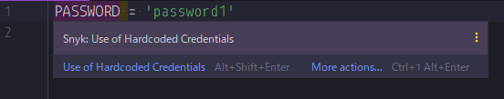
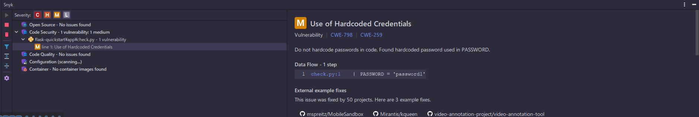
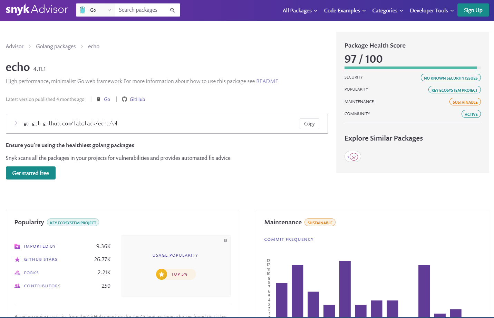

こちらの記事は [Snykを使ってコードをセキュアにした記事を投稿しよう！ by Snyk Advent Calendar 2023](https://qiita.com/advent-calendar/2023/snyk)
の 16 日目の記事です。

---


セキュリティチェックは、いいぞ。


現職で Snyk というツールを知ってから、早速個人開発しているリポジトリにも導入してみたところ、すごく良かったので共有させていただきます。  
ここでは Snyk の具体的な導入方法については省略しますが、GitHub のリポジトリを連携してトークンを登録するだけなのでとても簡単でした。

## :bulb: 使ってみて分かった特徴

### JetBrains 社製エディタとの連携が可能

普段の業務で JetBrains 社製エディタを使用していますが、エディタに Snyk のプラグインをインストールすれば、
Snyk の管理画面を参照することなくセキュリティレポートをチェックしたり、スキャンをその場で実行したりできます。

### 脆弱性の重要度がスコアで表される

脆弱性と一口に言っても、システム的には優先度を決めて対応しなければならないことがほとんどです。  
Snyk では脆弱性一つ一つにスコアがついていて、スコアが高いほど重要な（急ぎで対応した方がよい）ものだと一目でわかります。

### プルリク作成・更新時にスキャンできる

Snyk ではプルリクエスト作成・更新時にコードスキャンやライブラリの診断を実行可能です。  
CI/CD の通過をマージの条件にすることで、脆弱性の診断漏れを防ぐこともできます。

## :smile: 使ってみて感じたメリット

### セキュアなコードを書くためのヒントが得られる

Snyk のコードスキャンは AI が元になっています。
スキャンで指摘される内容は基本的に、これまでの歴史で良くない書き方とされてきたものを学習してきた結果と言えます。  
そのため、コードスキャンの指摘事項に一つ一つ対応することで、セキュリティ的に良くない書き方を一定程度学習することができます。

### ライブラリを比較・検討する判断視点が身につく

Snyk にはコードスキャンのほかにオープンソースの脆弱性を診断する Open Source Advisor があります。

https://snyk.io/advisor/

Open Source Advisor で npm や PyPI のライブラリを検索し、ヘルススコアを参考に導入するかどうかを判断できるため、とても便利です。  

私自身、今までライブラリを選定する際は以下の 3 点を判断基準としていました。

- ライブラリの利用者数が多いこと
- マニュアルやコミュニティが充実していること
- リポジトリに対するコミットが活発であること（バージョンアップの頻度・最終コミットが現在からどれくらい前かなど）

それに対し Snyk は以下の 4 点を考慮しています。

- Popularity 普及度
- Maintenance 持続可能性
- Security セキュリティ体制
- Community コミュニティ

私が基準としていたものをすべて網羅するとともに、セキュリティ面に関する基準が加わっています。

大きな組織でライブラリ選定に関する承認が必要な場合に、ヘルススコアは根拠として使えると思います。  
決してヘルススコアが高いことをライブラリ選定の唯一の理由にするのではなく、自分の目でも確認することが大事かと思います。

### 指摘事項を解消していく楽しみがある

コードスキャンで指摘された事項に対し、ひとつひとつ解消していくという過程そのものが
RPG ゲームでミッションを順番に進めていくときのように思えて楽しいです。

## :cry: デメリット

### 料金プランが激しい（？）

現在のプラン料金は「無料」「52 ドル/人月」「お見積り」と、個人でがっつり使う場面ではなかなか予算が組みにくいのが現状です。  
月数ドル程度で契約できる個人向け有料プランがあったらいいなと思いました。

### スペルミスして Synk と書いてしまう時がある

文字だけで見ないで「スニーク」という音も合わせて覚えましょう。  
同期を表す sync とは異なります。
