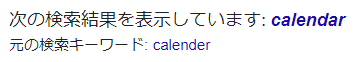

アドベントカレンダーでふと思い出したのですが、みなさんはカレンダー（暦とか読むほう）の英語のスペル、正しく覚えていますでしょうか？ :thinking:

私は間違えて覚えていました :flushed:

---

## 正解

正解は `Calendar` です。

[Cambridge Dictionary](https://dictionary.cambridge.org/ja/dictionary/english/calendar) によると、「その年の月や週、日にちが書いてある表のこと」だそうです。

> a printed table showing all the days, weeks, and months of the year

---

## 私が間違って覚えていたやつ

私は `Calender` と間違って覚えていたのですが、これはどういう意味かというと、 Cambridge Dictionary には載っていなくて、[アルクの辞書](https://eow.alc.co.jp/search?q=calender) から引用させていただきます。

> 〔紙や布などの〕カレンダー、光沢機、艶出し機◆ローラーで圧力を加えて紙や布に光沢を与えたり、その他の素材を薄く一定の厚さに伸ばしたりする装置。

ちょっと意味が違いますね :laughing:

`Advent Calendar` とかはコピペして書いていたので大丈夫だったんですが、 `Calender` でググって調べたときにこんなのが出てきたもんだから :sweat_drops:

<!-- @IGNORE PREVIOUS: link -->

サーバー作業で typo は禁物です、気を付けましょう :wink: （どの口が言う）
